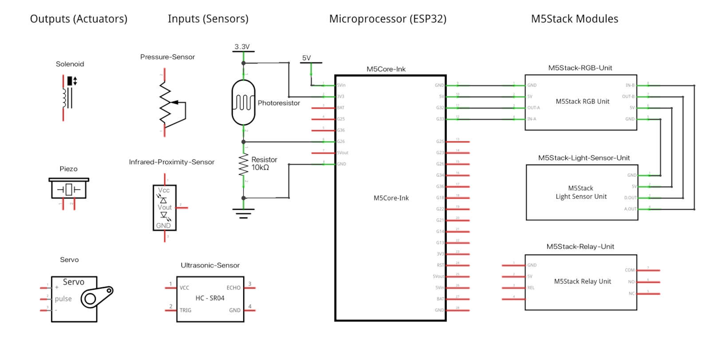
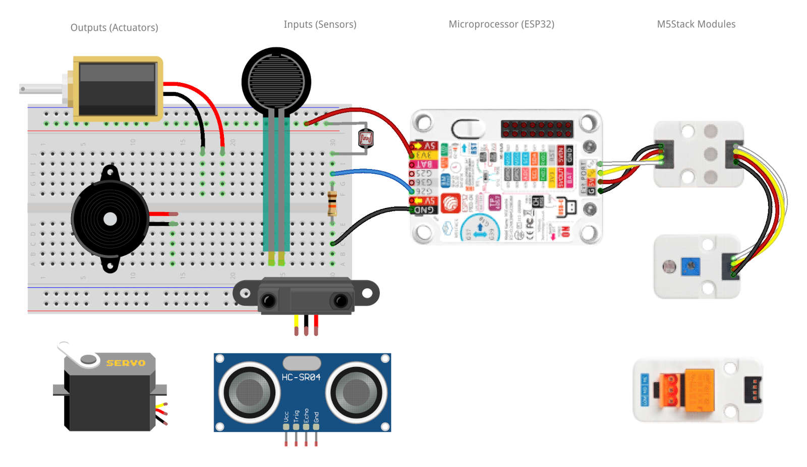

## Fritzing Files

The [Fritzing](https://fritzing.org/) `.fzz` file in this directory features the input and output components used in students' projects, including the M5Core-Ink board and a few M5Stack plug-in modules.   

### Fritzing Template Schematic View

### Fritzing Template Breadboard View

